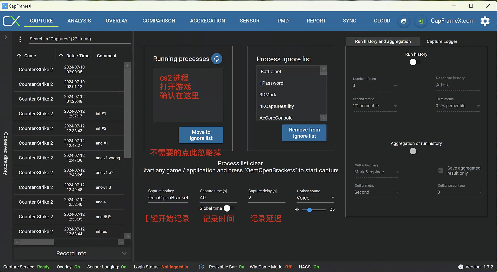

# CS2 FPS Benchmark

CS2帧数测试方案

- 扣扣群：687767969
- 配置解析视频：https://www.bilibili.com/video/BV19cseeqEAU
- 25年优化视频：https://www.bilibili.com/video/BV1P3rcYSEcB

## 路线 Roadmap

- [X] 主要源
- [ ] 备用源
- [x] 画面设置
- [x] 提交数据的收集表链接
- [x] 汇总表格链接
- [ ] 说明网页搭建和部署
- [ ] 说明网页：收集结果可视化
- [ ] 自动放置文件的工具
- [ ] 制作并上传视频

## 测试信息

**优先测试 Inferno**，有必要时考虑其他地图

| 地图    | CFG | 版本 | Demo日期  | 开始Tick | 测试时长 | 延迟记录 | 玩家编号 | 玩家名称  |
| ------- | ------- | ---- | --------- | -------- | -------- | ------------ | ------------ | --------- |
| **Inferno** | inf.cfg | v1   | 2024.6.23 | 64500    | 40s      | 2s           | 8            | 『 5号 』 |
| Ancient | anc.cfg | v1   | 2024.7.5  | 19920    | 40s      | 2s           | 3            | Rop紫     |

## 测试准备

下载对应打包好的压缩文件：[主要源](https://share.hlae.site/%E4%B8%BB%E8%A6%81%E6%BA%90/CS2%E5%B8%A7%E6%95%B0%E6%B5%8B%E8%AF%95) | [备用源](https://share.hlae.site/%E5%A4%87%E7%94%A8%E6%BA%90/CS2%E5%B8%A7%E6%95%B0%E6%B5%8B%E8%AF%95)

找到游戏目录：Steam库中 → 右键CS2 → 管理 → 浏览本地文件

> 游戏目录：...steamapps\common\Counter-Strike Global Offensive

### 放置 Demo 文件

`.dem` 文件放置于 `游戏目录\game\csgo`

### 放置 CFG 文件

`.cfg` 文件放置于 `游戏目录\game\csgo\cfg`

### 设置启动项

启动项务必添加`-allow_third_party_software` 或 `-insecure`

> insecure只能本地游戏或回放录像

### 设置帧数记录工具

工具：[CapFrameX](https://www.capframex.com/) | 镜像下载源

快捷键：`[`

收集数据：平均帧 `Average` 和 百分之一Low帧 `P1`

延迟记录：2s

## 测试设置

### 分辨率

必测：1920x1080 · 1280x960（使用率高）

可选：3840x2160 · 2560x1440

### 画面设置

统一使用如下的推荐画面设置，如有其他设置请在提交时注明

> 参考CCE的[画面设置贴](https://api.xiaoheihe.cn/v3/bbs/app/api/web/share?link_id=126988221)
>
> 24年10月已更新，阴影调低

| 画面选项               | 推荐设置           | 说明              |
| ---------------------- | ------------------ | ----------------- |
| 多重采样抗锯齿         | 2X MSAA            | CMAA2可替代`无`，但在大厦的铁栅栏等场景看不到敌人 |
| 全局阴影效果           | 低                 | 影响光照下阴影质量，影子渲染距离没有差异 |
| 动态阴影               | 全部               | 灯光下是否产生影子，个别地图无动态光源可以设置为“仅太阳" |
| 模型/贴图细节          | 中                 | 影响贴图质量和曳光弹清晰度，`低`造成马赛克击中反馈和损失一些道具瞄点 |
| 贴图过滤模式           | 异向4X             | 影响玩家模型和皮肤清晰度，4x一般足够 |
| 光影细节               | 低                 | 不影响游戏平衡，但大幅度影响帧数 |
| 粒子细节               | 低                 | 不影响游戏平衡，但大幅度影响帧数 |
| 环境光遮蔽             | 已禁用             | 当前版本没什么用 |
| 高动态范围             | 性能               | 性能时有些地方会出现噪点，品质会吃性能 |
| Fidelity FX 超级分辨率 | 已禁用（最高品质） | AMD的FSR超分辨率技术，当前版本用的比较老的FSR1.0 |

## 测试结果收集

### 提交测试结果

【腾讯文档】CS2帧数测试收集：https://docs.qq.com/form/page/DZVVpUWdMUlZqVmFE

### 汇总表格

【腾讯文档】CS2帧数测试收集结果（不定期更新）
https://docs.qq.com/sheet/DZWphZE16ZWFvYkdH?tab=BB08J2

> TODO 制作好之后在：https://cs2.upup.cool

## 更新或补充Demo

1. 安装 **Node.js** 环境
2. 切换到 `benchmark` 目录：`cd benchmark`
3. 安装依赖：`npm i -g pnpm` 后 `pnpm i`
4. 修改 `config` 目录中的配置文件，也可以新增 `地图-版本号.yaml`
5. 准备好demo，推荐放在 `demo` 文件夹，记下 **demo文件路径**
6. 生成对应文件并打包：`pnpm gen 设置文件路径 demo文件路径`，如：
   `pnpm gen config/inf-v1.yaml demo/inf-v1.dem`
7. 修改 `README.md` 的 Demo 信息表格，准备好打包的zip文件，并提交PR

> 可选：修改 `benchmark/run.cmd` 添加新demo的运行指令，方便批量更新
